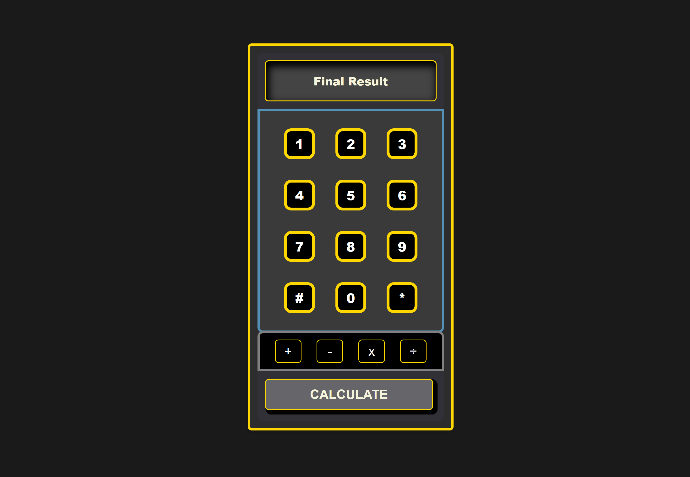

# Calcutron 8000

  
*A functional calculator built from scratch.*
[Live Project Demo](https://calcutron-8000.netlify.app/)

## Description

The **Foundations Calculator** is an on-screen calculator crafted with **JavaScript**, **HTML**, and **CSS** as the final project for The Odin Project's Foundations Course. This application demonstrates my mastery of front-end development fundamentals, including DOM manipulation, event handling, and responsive design. It’s a practical tool that performs basic arithmetic operations while handling edge cases with elegance and precision.

## Features

- **Core Operations**: Addition, subtraction, multiplication, and division.
- **Intuitive Interface**: Buttons for digits (0-9), operators (+, -, *, /), equals (=), and a clear function.
- **Real-Time Feedback**: Display updates instantly as users input numbers and operators.
- **Edge Case Handling**: Custom error message for division by zero; prevents incomplete expression evaluation.
- **Precision**: Rounds long decimal results to avoid display overflow.
- **Single-Pair Evaluation**: Processes one pair of numbers at a time, mimicking real calculator behavior.

## Technologies Used

- **HTML5**: Structures the calculator’s layout and interface.
- **CSS3**: Delivers a modern, polished design with responsive styling.
- **JavaScript**: Powers the logic, interactivity, and state management.

## Installation/Setup Instructions

Get the calculator running locally in just a few steps:

1. Clone the repository:
   ```bash
   git clone https://github.com/yourusername/foundations-calculator.git
   ```
2. Navigate to the project directory:
   ```bash
   cd foundations-calculator
   ```
3. Open `index.html` in your web browser:
   - Simply double-click the file or use a local server (e.g., `npx live-server`).

No dependencies required—just pure vanilla code!

## Usage

- **Input Numbers**: Click digit buttons (0-9) to build your numbers.
- **Select Operator**: Choose +, -, *, or / to set the operation.
- **Calculate**: Press = to see the result.
- **Reset**: Hit the Clear button to start fresh.

*Example*: Click `3`, `+`, `5`, then `=`. The display shows `8`.

## Challenges and Learnings

This project pushed my skills to new heights. Key takeaways include:

- **Operation Logic**: Built a robust `operate()` function to handle number-operator-number sequences, ensuring evaluations only trigger with complete expressions.
- **Edge Cases**: Tackled division by zero with a snarky “Nice try!” message and prevented crashes from premature equals presses or consecutive operators.
- **UI/UX**: Balanced functionality with aesthetics, using CSS to create an intuitive button layout and readable display.

These challenges deepened my expertise in JavaScript event listeners, state management, and CSS grid/flexbox layouts.

## Future Improvements

- **Advanced Functions**: Add exponents, square roots, or percentages.
- **Keyboard Support**: Enable number and operator input via keyboard for accessibility.
- **Theming**: Introduce light/dark modes or custom styles.
- **Calculation History**: Store and display past results.

## Contributing

This project is primarily a learning showcase, but I’m open to collaboration! To contribute:

1. Fork the repository.
2. Create a feature branch (`git checkout -b feature/awesome-improvement`).
3. Commit your changes (`git commit -m "Add awesome improvement"`).
4. Push to your branch (`git push origin feature/awesome-improvement`).
5. Open a pull request.

## License

This project is released under the [MIT License](LICENSE). Feel free to use, modify, or distribute it as you see fit.

## Contact Information

Let’s connect!  
- **Email**: garebearcodes@gmail.com  
- **GitHub**: @myopicOracle
- **LinkedIn**: linkedin.com/in/xiagary

---
*https://calcutron-8000.netlify.app/*
