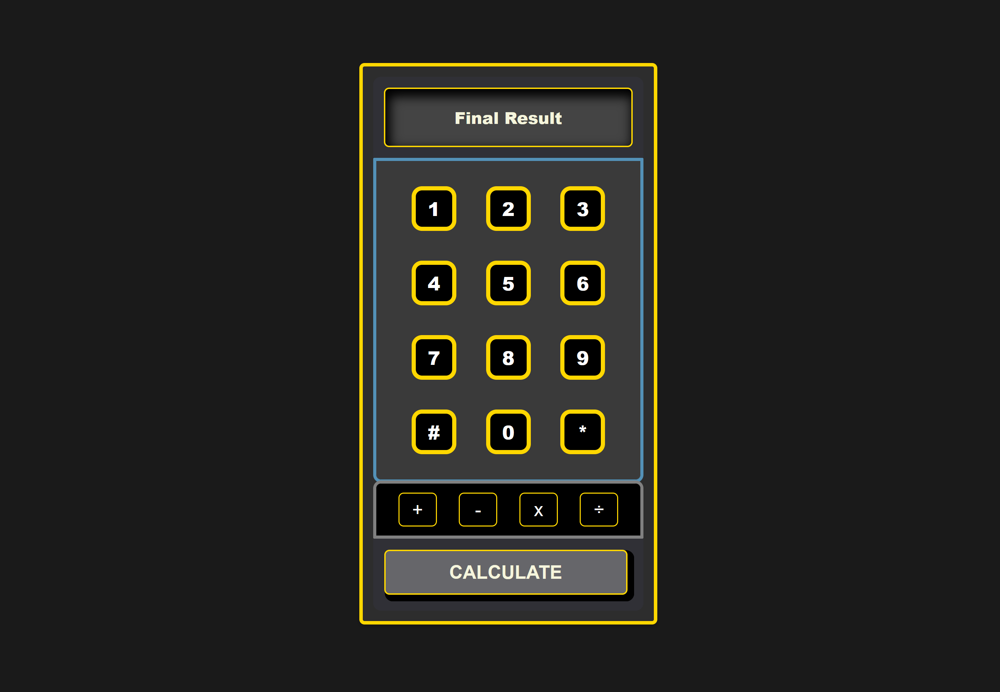

# Foundations Calculator

 

#### [**Live Demo:** calcutron-8000.netlify.app](https://calcutron-8000.netlify.app/)

## Project Overview

This was my final project for The Odin Project's [Foundations Course]((https://www.theodinproject.com/paths/foundations/courses/foundations)) - a solo capstone that brought together everything I'd learned about HTML, CSS, and JavaScript. I built a functional calculator from the ground up, starting with basic arithmetic functions and working through the complex logic of handling user input sequences.

## What I Built

The calculator handles the four basic operations:
- Addition, subtraction, multiplication, division
- Digit buttons (0-9) and operator buttons
- A display that shows input and results
- Calculate button to perform operations

## The Learning Journey

### Starting Point
I began by creating the core math functions (`add`, `subtract`, `multiply`, `divide`) and testing them in the browser console. Simple stuff, but it was my first time organizing functions that would work together.

### The Hard Part
The biggest challenge was figuring out the calculator's logic flow. How do you handle the sequence of: number → operator → number → calculate? I went through several iterations:

- **First attempt**: Used a simple counter system to track clicks (1, 2, 3...) - you can see this in `script_v2_mise_stage.js` where I started with `if 1st click, store value to "a"`
- **Problem**: This was rigid and broke easily if users clicked out of sequence - the `script_v3_working_all_buttons_linked_manually.js` shows my pseudocode struggles
- **Solution**: Eventually figured out proper state management to track first number, operator, and second number - see the working version in `deploy-root/script.js`

### What I Struggled With

- **Event handling**: Getting buttons to respond correctly took many tries - see `script_v1.js` for my first attempts with basic alerts
- **State management**: Keeping track of which number was being input and when to calculate - the counter system in `deploy-root/script.js` shows my solution
- **DOM manipulation**: Updating the display at the right time - struggled with this across multiple iterations
- **Edge cases**: Division by zero, incomplete expressions - handled in the final version but took several tries to get right

You can see my thought process in the `test_run.js` file - it's full of pseudocode and failed attempts that eventually led to the working solution.

## How It Works

The calculator uses a simple state machine approach:
1. User clicks a digit → stores as first number
2. User clicks an operator → stores operation type  
3. User clicks second digit → stores as second number
4. User clicks Calculate → performs the operation and shows result

## What I'd Do Differently Now

Looking back, I can see several areas where I'd improve this:
- Better error handling instead of alerts
- Keyboard support for accessibility
- Clear button to reset between calculations
- More robust state management

But that's the point of learning projects - they show where you started and how much you've grown.

## Running the Project

1. Open `deploy-root/index.html` in your browser
2. Or clone and run locally with any web server

No build process needed - just vanilla HTML, CSS, and JavaScript.

---
***Project Link**: [The Odin Project - Foundations Calculator](https://www.theodinproject.com/lessons/foundations-calculator)*
